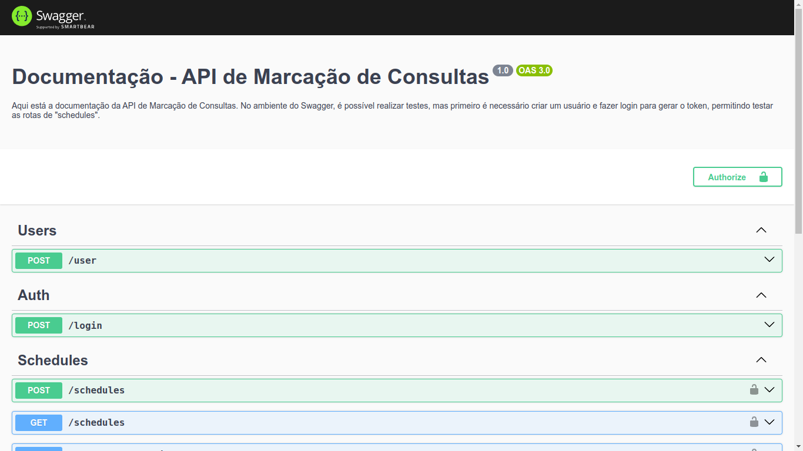

### Observação

Este repositório contem o **Desafio de Backend - API de Marcação de Consultas**, meu **linkedin** é  _[Willian Alves Batista](https://www.linkedin.com/in/willian-alves-batista-60aa6a180/)_, e o contato/whatsApp é **(27) 997366918**.

 

## Desafio de Backend - API de Marcação de Consultas de Willian Alves.

#### Tecnologias utilizadas:

  - TypeScript;
  - Node.js;
  - Nest.js;
  - Jwt;
  - Class-validator;
  - Bcrypt;
  - Postgresql;
  - Docker;
  - Restful;
  - eslint;
  - vscode;

## Inciando o projeto

Descrição

 
  
:warning: **É necessário ter o docker-compose instalado.**

Para iniciar o projeto, basta baixar ou clonar este repositório.

Acesse a raiz do projeto, abra o terminal, em seguida digite:

    docker-compose -f docker-compose.yml up -d

 

### Swagger UI - Documentação interativa

Descrição

 

Com o projeto em execução, o Swagger fica disponível em http://localhost:4000/api . Esta documentação da API permite visualizar de forma simples todos os endpoints, seus requisitos obrigatórios e suas respostas. Além disso, também é possível realizar testes.
  

 

## API lista de rotas disponíveis e como utilizá-las.

Descrição

 

**Observação:** Com o projeto em execução, a API fica disponível em http://localhost:4000

### Users

**POST /user**

Rota para criar usuário.

corpo da requesição:

    {
      "email": "exemple@email.com",
      "password": "P@ssw0rd",
      "name": "Willian Alves Batista",
      "cpf": "15784763222",
      "dateBirth": "AAAA-MM-DD"
    }

### Auth

**POST /login**

Rota para obter o Token, que será necessário para as próximas requisições.

corpo da requesição:

    {
      "email": "exemple@email.com",
      "password": "P@ssw0rd"
    }

### Schedules

**Observação:** Todos os seguintes endpoints exigem um token para acesso.

**POST /schedules**

Rota para agendar consulta, após criada retorna o PDF com dados da consulta.

corpo da requesição:

    {
      "date": "AAAA-MM-DD",
      "hours": "HH:MM:SS",
      "medicalSpecialty": "Clínico geral"
    }

**GET /schedules**

Rota para lista todas as consultas do usuário.

**GET /schedules/pdf/:id**

Rota para disponibilizar dados em PDF da consulta escolhida.

**GET /schedules/:id**

Rota para disponibilizar dados da consulta escolhida.

**PATCH /schedules/:id**

Rota para modificar data ou hora da consulta. É necessário fornecer ambos os valores no corpo da requisição, mesmo que não se pretenda modificar uma das opções, pois isso assegura um melhor time zone para o banco de dados.

corpo da requesição:

    {
      "date": "AAAA-MM-DD",
      "hours": "HH:MM:SS"
    }

**DELETE /schedules/:id**

Rota utilizada para cancelar uma consulta, na prática, excluindo a consulta agendada.

