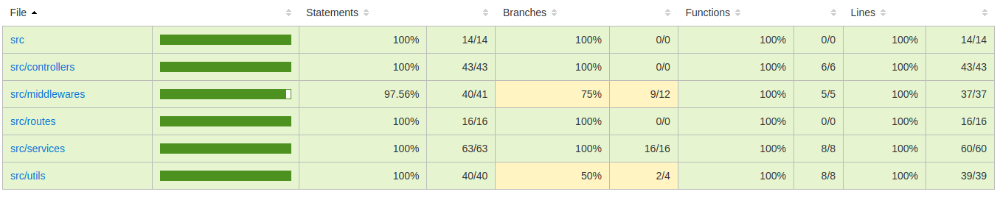

# Desafio de Backend - API de Marcação de Consultas

## Candidato

- Rafael da Cunha Santos
- [LinkedIn](https://www.linkedin.com/in/rafaelcunhas/)
- [Github](https://github.com/RafaelCunhaS)
- Email: rafaelcs_94@hotmail.com

### Ferramentas utilizadas:

- [Node](https://nodejs.org/en/): Ambiente de execução JavaScript de código aberto e multiplataforma
- [Express](https://pactumjs.github.io/): Framework para Node.js para construção de servidores web.
- [Postgres](https://www.postgresql.org/): Banco de dados relacional.
- [Sequelize](https://sequelize.org/): ORM moderna para Node.js.
- [Joi](https://joi.dev/): Biblioteca para descrição de esquemas e validação de dados em JavaScript.
- [JWT](https://jwt.io/): Geração de tokens com assinatura opcional e/ou criptografia, utilizado para autenticação dos usuários.
- [express-async-errors](https://www.npmjs.com/package/express-async-errors): Pacote suporte para o express, captura os erros lançados pela api. Ajuda a manter o código mais limpo, sem diversos blocos try/catch.
- [puppeteer](https://pptr.dev/): Biblioteca que permite a criação de arquivos PDF utilizando HTML.
- [swagger-ui-express](https://www.npmjs.com/package/swagger-ui-express): Módulo para gerar documentação Swagger através de um arquivo JSON.

## Rodar o projeto localmente:

**É necessário ter o [Docker Compose](https://docs.docker.com/compose/install/) e o [Node.js](https://nodejs.org/en/download) instalados em sua máquina para rodar o projeto**

```bash
    # Clone o repositório
    $ git clone git@github.com:RafaelCunhaS/desafio-backend.git

    # Entre no diretório do projeto
    $ cd desafio-backend

    # Instale as dependências
    $ npm install

    # Suba o container do banco de dados
    $ docker compose up -d

    # Rode o projeto
    $ npm start
```

**Com o projeto rodando, a documentação da API se encontrará em [localhost:3000/api-docs](http://localhost:3000/api-docs)**

### Ferramentas de teste utilizadas(unitários e integração):

- [Jest](https://jestjs.io/pt-BR/): Poderoso framework de testes em JavaScript com um foco na simplicidade.
- [Supertest](https://www.npmjs.com/package/supertest): Biblioteca para testes de servidores HTTP.

## Testando a API:

**Pare a aplicação caso ela ainda esteja rodando**

```bash
    # Rodar testes unitários
    $ npm run test:unit

    # Rodar testes de integração (O container do banco de dados precisa estar rodando)
    $ npm run test:integration

    # Rodar todos os testes
    $ npm run test

    # Rodar a cobertura dos testes
    $ npm run test:coverage
```



## Parando o container do banco de dados:

```bash
    $ docker compose down --remove-orphans -v
```
